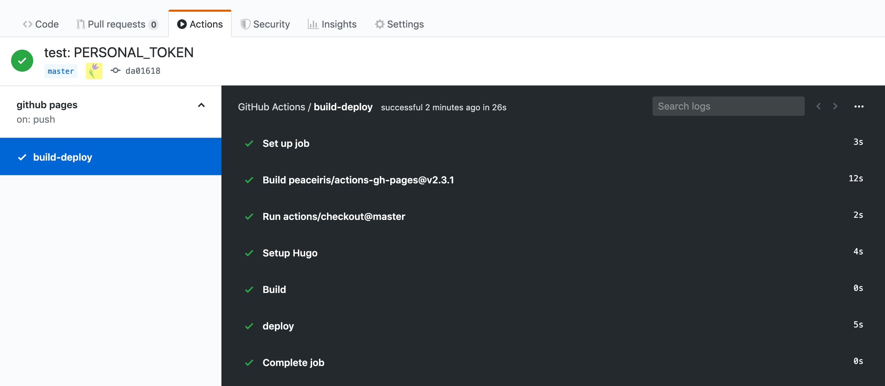
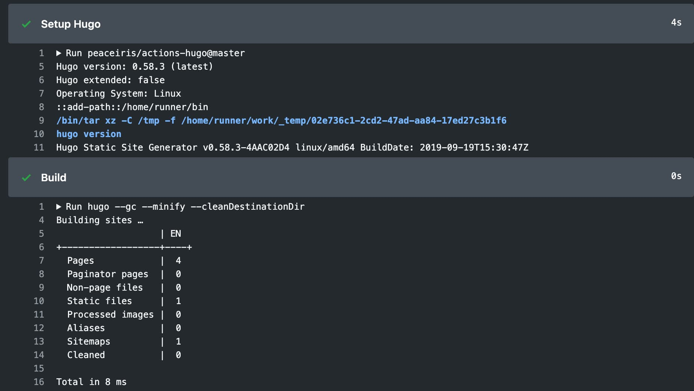
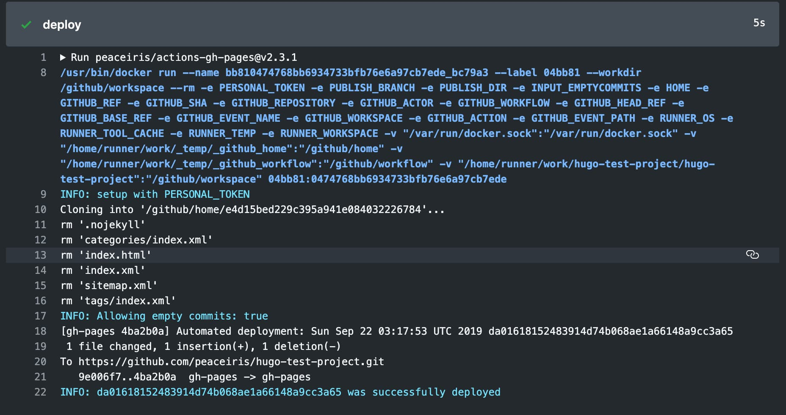
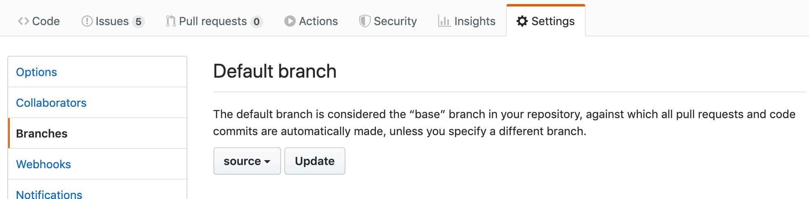

[](https://github.com/peaceiris/actions-gh-pages/blob/master/LICENSE)
[](https://github.com/peaceiris/actions-gh-pages/releases/latest)
[](https://github.com/peaceiris/actions-gh-pages/releases)

[](https://hub.docker.com/r/peaceiris/gh-pages)


## GitHub Actions for GitHub Pages

This is a **GitHub Action** to deploy your static files to **GitHub Pages**.
This deploy action can be combined simply and freely with [Static Site Generators]. (Hugo, MkDocs, Gatsby, GitBook, mdBook, etc.)

[Static Site Generators]: https://www.staticgen.com/

The next example step will deploy `./public` directory to the remote `gh-pages` branch.

```yaml
- name: Deploy
  uses: peaceiris/actions-gh-pages@v2.5.0
  env:
    ACTIONS_DEPLOY_KEY: ${{ secrets.ACTIONS_DEPLOY_KEY }}
    # PERSONAL_TOKEN: ${{ secrets.PERSONAL_TOKEN }}
    # GITHUB_TOKEN: ${{ secrets.GITHUB_TOKEN }}
    PUBLISH_BRANCH: gh-pages
    PUBLISH_DIR: ./public
```

Three tokens are supported.

| Token | Private repo | Public repo | Protocol | Setup |
|---|:---:|:---:|---|---|
| `GITHUB_TOKEN` | ✅️ | ❌️ | HTTPS | Unnecessary |
| `PERSONAL_TOKEN` | ✅️ | ✅️ | HTTPS | Necessary |
| `ACTIONS_DEPLOY_KEY` | ✅️ | ✅️ | SSH | Necessary |

Do you want to skip the docker build step? OK, the script mode is available.

```yaml
- name: Deploy
  env:
    ACTIONS_DEPLOY_KEY: ${{ secrets.ACTIONS_DEPLOY_KEY }}
    PUBLISH_BRANCH: gh-pages
    PUBLISH_DIR: ./public
    SCRIPT_MODE: true
  run: |
    wget https://raw.githubusercontent.com/peaceiris/actions-gh-pages/v2.5.0/entrypoint.sh
    bash ./entrypoint.sh
```


## Table of Contents

<!-- START doctoc generated TOC please keep comment here to allow auto update -->
<!-- DON'T EDIT THIS SECTION, INSTEAD RE-RUN doctoc TO UPDATE -->


- [Getting started](#getting-started)
  - [(1) Add SSH deploy key](#1-add-ssh-deploy-key)
  - [(2) Create your workflow](#2-create-your-workflow)
    - [⭐️ Repository type - Project](#%EF%B8%8F-repository-type---project)
    - [⭐️ Repository type - User and Organization](#%EF%B8%8F-repository-type---user-and-organization)
- [Options](#options)
  - [⭐️ Pull action image from Docker Hub](#%EF%B8%8F-pull-action-image-from-docker-hub)
  - [⭐️ `PERSONAL_TOKEN`](#%EF%B8%8F-personal_token)
  - [⭐️ `GITHUB_TOKEN`](#%EF%B8%8F-github_token)
  - [⭐️ Suppressing empty commits](#%EF%B8%8F-suppressing-empty-commits)
  - [⭐️ Keeping existing files](#%EF%B8%8F-keeping-existing-files)
  - [⭐️ Deploy to external repository](#%EF%B8%8F-deploy-to-external-repository)
  - [⭐️ Script mode](#%EF%B8%8F-script-mode)
- [Tips and FAQ](#tips-and-faq)
  - [⭐️ Use the latest and specific release](#%EF%B8%8F-use-the-latest-and-specific-release)
  - [⭐️ How to add `CNAME`](#%EF%B8%8F-how-to-add-cname)
  - [⭐️ Deployment completed but you cannot read](#%EF%B8%8F-deployment-completed-but-you-cannot-read)
- [Examples](#examples)
  - [⭐️ Static Site Generators with Node.js](#%EF%B8%8F-static-site-generators-with-nodejs)
  - [⭐️ Gatsby](#%EF%B8%8F-gatsby)
  - [⭐️ React and Next](#%EF%B8%8F-react-and-next)
  - [⭐️ Vue and Nuxt](#%EF%B8%8F-vue-and-nuxt)
  - [⭐️ Static Site Generators with Python](#%EF%B8%8F-static-site-generators-with-python)
  - [⭐️ mdBook (Rust)](#%EF%B8%8F-mdbook-rust)
- [License](#license)
- [About the author](#about-the-author)

<!-- END doctoc generated TOC please keep comment here to allow auto update -->


## Getting started

### (1) Add SSH deploy key

Generate your deploy key with the following command.

```sh
ssh-keygen -t rsa -b 4096 -C "$(git config user.email)" -f gh-pages -N ""
# You will get 2 files:
#   gh-pages.pub (public key)
#   gh-pages     (private key)
```

Next, Go to **Repository Settings**

- Go to **Deploy Keys** and add your public key with the **Allow write access**
- Go to **Secrets** and add your private key as `ACTIONS_DEPLOY_KEY`

| Add your public key | Success |
|---|---|
|  |  |

| Add your private key | Success |
|---|---|
|  |  |

### (2) Create your workflow

Add your workflow setting YAML file `.github/workflows/gh-pages.yml` and push to the default branch.

#### ⭐️ Repository type - Project

An example workflow for Hugo.

- [peaceiris/actions-hugo: GitHub Actions for Hugo](https://github.com/peaceiris/actions-hugo)

[](https://github.com/peaceiris/actions-hugo)


```yaml
name: github pages

on:
  push:
    branches:
    - master

jobs:
  build-deploy:
    runs-on: ubuntu-18.04
    steps:
    - uses: actions/checkout@master
      # with:
      #   submodules: true

    - name: Setup Hugo
      uses: peaceiris/actions-hugo@v2.3.0
      with:
        hugo-version: '0.59.1'

    - name: Build
      run: hugo --minify

    - name: Deploy
      uses: peaceiris/actions-gh-pages@v2.5.0
      env:
        ACTIONS_DEPLOY_KEY: ${{ secrets.ACTIONS_DEPLOY_KEY }}
        PUBLISH_BRANCH: gh-pages
        PUBLISH_DIR: ./public
```

The above example is for [Project Pages sites]. (`<username>/<project_name>` repository)

| Actions log overview | Build step log |
|---|---|
|  |  |

| Deploy step log | GitHub Pages log |
|---|---|
|  |  |

#### ⭐️ Repository type - User and Organization

For [User and Organization Pages sites] (`<username>/<username>.github.io` repository),
we have to set `master` branch to `PUBLISH_BRANCH`.

```yaml
on:
  push:
    branches:
    - source  # default branch

PUBLISH_BRANCH: master  # deploying branch
```

[Project Pages sites]: https://help.github.com/en/articles/user-organization-and-project-pages#project-pages-sites
[User and Organization Pages sites]: https://help.github.com/en/articles/user-organization-and-project-pages#user-and-organization-pages-sites



<div align="right">
<a href="#table-of-contents">Back to TOC ☝️</a>
</div>


## Options

### ⭐️ Pull action image from Docker Hub

You can pull a public docker image from Docker Hub.
By pulling docker images, you can reduce the overall execution time of your workflow. In addition, `latest` tag is provided.

```diff
- uses: peaceiris/actions-gh-pages@v2.5.0
+ uses: docker://peaceiris/gh-pages:v2.5.0
```

- [peaceiris/gh-pages - Docker Hub](https://hub.docker.com/r/peaceiris/gh-pages)

### ⭐️ `PERSONAL_TOKEN`

[Generate a personal access token (`repo`)](https://github.com/settings/tokens) and add it to Secrets as `PERSONAL_TOKEN`, it works as well as `ACTIONS_DEPLOY_KEY`.

```diff
- ACTIONS_DEPLOY_KEY: ${{ secrets.ACTIONS_DEPLOY_KEY }}
+ PERSONAL_TOKEN: ${{ secrets.PERSONAL_TOKEN }}
```

### ⭐️ `GITHUB_TOKEN`

> ⚠️ **NOTES**: `GITHUB_TOKEN` works only on a **private** repository.
>
> This action supports `GITHUB_TOKEN` but it has some problems to deploy to GitHub Pages. GitHub team is investigating that. See [Issue #9]

[Issue #9]: https://github.com/peaceiris/actions-gh-pages/issues/9

```diff
- ACTIONS_DEPLOY_KEY: ${{ secrets.ACTIONS_DEPLOY_KEY }}
+ GITHUB_TOKEN: ${{ secrets.GITHUB_TOKEN }}
```

### ⭐️ Suppressing empty commits

By default, a commit will always be generated and pushed to the `PUBLISH_BRANCH`, even if nothing changed. If you want to suppress this behavior, set the optional parameter `emptyCommits` to `false`. cf. [Issue #21]

[Issue #21]: https://github.com/peaceiris/actions-gh-pages/issues/21

For example:

```yaml
- name: Deploy
  uses: peaceiris/actions-gh-pages@v2.5.0
  env:
    ACTIONS_DEPLOY_KEY: ${{ secrets.ACTIONS_DEPLOY_KEY }}
    PUBLISH_BRANCH: gh-pages
    PUBLISH_DIR: ./public
  with:
    emptyCommits: false
```

### ⭐️ Keeping existing files

By default, existing files in the publish branch are removed before adding the ones from publish dir. If you want the action to add new files but leave existing ones untouched, set the optional parameter `keepFiles` to `true`.

For example:

```yaml
- name: Deploy
  uses: peaceiris/actions-gh-pages@v2.5.0
  env:
    ACTIONS_DEPLOY_KEY: ${{ secrets.ACTIONS_DEPLOY_KEY }}
    PUBLISH_BRANCH: gh-pages
    PUBLISH_DIR: ./public
  with:
    keepFiles: true
```

### ⭐️ Deploy to external repository

By default, your files are published to the repository which is running this action.
If you want to publish to another repository on GitHub, set the environment variable `EXTERNAL_REPOSITORY` to `<username>/<external-repository>`.
This option is available from `v2.5.0`.

For example:

```yaml
- name: Deploy
  uses: peaceiris/actions-gh-pages@v2.5.0
  env:
    ACTIONS_DEPLOY_KEY: ${{ secrets.ACTIONS_DEPLOY_KEY }}
    EXTERNAL_REPOSITORY: username/external-repository
    PUBLISH_BRANCH: gh-pages
    PUBLISH_DIR: ./public
```

You can use `ACTIONS_DEPLOY_KEY` or `PERSONAL_TOKEN`.
When you use `ACTIONS_DEPLOY_KEY`, set your private key to the repository which includes this action and set your public key to your external repository.

Be careful, `GITHUB_TOKEN` has no permission to access to external repositories.

### ⭐️ Force orphan

From `v2.6.0`, we can set the `forceOrphan: true` option.
This allows you to make your publish branch with only the latest commit.

```yaml
- name: Deploy
  uses: peaceiris/actions-gh-pages@v2.6.0
  env:
    ACTIONS_DEPLOY_KEY: ${{ secrets.ACTIONS_DEPLOY_KEY }}
    PUBLISH_BRANCH: gh-pages
    PUBLISH_DIR: ./public
  with:
    forceOrphan: true
```

### ⭐️ Script mode

From `v2.5.0`, we can run this action as a shell script.
There is no Docker build or pull step, so it will start immediately.

- `ACTIONS_DEPLOY_KEY` requires `SCRIPT_MODE: true`
- `*_TOKEN` do not require `SCRIPT_MODE`

```yaml
- name: Deploy
  env:
    ACTIONS_DEPLOY_KEY: ${{ secrets.ACTIONS_DEPLOY_KEY }}
    PUBLISH_BRANCH: gh-pages
    PUBLISH_DIR: ./public
    SCRIPT_MODE: true
  run: |
    wget https://raw.githubusercontent.com/peaceiris/actions-gh-pages/v2.5.0/entrypoint.sh
    bash ./entrypoint.sh
```

<div align="right">
<a href="#table-of-contents">Back to TOC ☝️</a>
</div>


## Tips and FAQ

### ⭐️ Use the latest and specific release

We recommend you to use the latest and specific release of this action for stable CI/CD.
It is useful to watch this repository (release only) to check the [latest release] of this action.

[latest release]: https://github.com/peaceiris/actions-gh-pages/releases

### ⭐️ How to add `CNAME`

Most of the Static Site Generators support `CNAME` as a static file.

- [Use a Custom Domain | Hugo](https://gohugo.io/hosting-and-deployment/hosting-on-github/#use-a-custom-domain)
- [Using the Static folder | GatsbyJS](https://www.gatsbyjs.org/docs/static-folder/)

The same may be said of other files (`.nojekyll`, `BingSiteAuth.xml`, `robots.txt`, etc.). It is better to manage those files by Static Site Generators.

Does not your static site generator deal with the static files? No problem, you can add the file like the following.

```yaml
- name: Build
  run: |
    buildcommand
    cp ./path/to/CNAME ./public/CNAME

- name: Deploy
```

### ⭐️ Deployment completed but you cannot read

Does your `PUBLISH_DIR` contain files or directories that name starts with an underscore? (`_modules`, `_sources` and `_next`, etc.)
GitHub Pages does not read those by default.
Please add `.nojekyll` file to `PUBLISH_DIR`.

- [Bypassing Jekyll on GitHub Pages - The GitHub Blog](https://github.blog/2009-12-29-bypassing-jekyll-on-github-pages/)

> It is now possible to completely bypass Jekyll processing on GitHub Pages by creating a file named `.nojekyll` in the root of your pages repo and pushing it to GitHub. This should only be necessary if your site uses files or directories that start with underscores since Jekyll considers these to be special resources and does not copy them to the final site.

Does not your static site generator deal with the static files? No problem, you can add the file like the following.

```yaml
- name: Build
  run: |
    buildcommand
    touch ./public/.nojekyll

- name: Deploy
```

<div align="right">
<a href="#table-of-contents">Back to TOC ☝️</a>
</div>


## Examples

### ⭐️ Static Site Generators with Node.js

[hexo], [gitbook], [vuepress], [react-static], [gridsome], etc.

[hexo]: https://github.com/hexojs/hexo
[gitbook]: https://github.com/GitbookIO/gitbook
[vuepress]: https://github.com/vuejs/vuepress
[react-static]: https://github.com/react-static/react-static
[gridsome]: https://github.com/gridsome/gridsome

Premise: Dependencies are managed by `package.json` and `package-lock.json`


```yaml
name: github pages

on:
  push:
    branches:
    - master

jobs:
  build-deploy:
    runs-on: ubuntu-18.04
    steps:
    - uses: actions/checkout@master

    - name: Setup Node
      uses: actions/setup-node@v1
      with:
        node-version: '10.x'

    - name: Cache dependencies
      uses: actions/cache@v1
      with:
        path: ~/.npm
        key: ${{ runner.os }}-node-${{ hashFiles('**/package-lock.json') }}
        restore-keys: |
          ${{ runner.os }}-node-

    - run: npm ci

    - run: npm run build

    - name: Deploy
      uses: peaceiris/actions-gh-pages@v2.5.0
      env:
        ACTIONS_DEPLOY_KEY: ${{ secrets.ACTIONS_DEPLOY_KEY }}
        PUBLISH_BRANCH: gh-pages
        PUBLISH_DIR: ./public
```

### ⭐️ Gatsby

An example for [Gatsby] (Gatsby.js) project with [gatsby-starter-blog]

[Gatsby]: https://github.com/gatsbyjs/gatsby
[gatsby-starter-blog]: https://github.com/gatsbyjs/gatsby-starter-blog


```yaml
name: github pages

on:
  push:
    branches:
    - master

jobs:
  build-deploy:
    runs-on: ubuntu-18.04
    steps:
    - uses: actions/checkout@master

    - name: Setup Node
      uses: actions/setup-node@v1
      with:
        node-version: '10.x'

    - name: Cache dependencies
      uses: actions/cache@v1
      with:
        path: ~/.npm
        key: ${{ runner.os }}-node-${{ hashFiles('**/package-lock.json') }}
        restore-keys: |
          ${{ runner.os }}-node-

    - run: npm ci

    - run: npm run format

    - run: npm run test

    - run: npm run build

    - name: Deploy
      uses: peaceiris/actions-gh-pages@v2.5.0
      env:
        ACTIONS_DEPLOY_KEY: ${{ secrets.ACTIONS_DEPLOY_KEY }}
        PUBLISH_BRANCH: gh-pages
        PUBLISH_DIR: ./public
```

### ⭐️ React and Next

An example for [Next.js] (React.js) project with [create-next-app]

- cf. [Deploying a Next.js app into GitHub Pages · zeit/next.js Wiki](https://github.com/zeit/next.js/wiki/Deploying-a-Next.js-app-into-GitHub-Pages)

[Next.js]: https://github.com/zeit/next.js
[create-next-app]: https://nextjs.org/docs


```yaml
name: github pages

on:
  push:
    branches:
    - master

jobs:
  build-deploy:
    runs-on: ubuntu-18.04
    steps:
    - uses: actions/checkout@master

    - name: Setup Node
      uses: actions/setup-node@v1
      with:
        node-version: '10.x'

    - name: Get yarn cache
      id: yarn-cache
      run: echo "::set-output name=dir::$(yarn cache dir)"

    - name: Cache dependencies
      uses: actions/cache@v1
      with:
        path: ${{ steps.yarn-cache.outputs.dir }}
        key: ${{ runner.os }}-yarn-${{ hashFiles('**/yarn.lock') }}
        restore-keys: |
          ${{ runner.os }}-yarn-

    - run: yarn install

    - run: yarn build

    - run: yarn export

    - run: touch ./out/.nojekyll

    - name: deploy
      uses: peaceiris/actions-gh-pages@v2.5.0
      env:
        ACTIONS_DEPLOY_KEY: ${{ secrets.ACTIONS_DEPLOY_KEY }}
        PUBLISH_BRANCH: gh-pages
        PUBLISH_DIR: ./out
```

### ⭐️ Vue and Nuxt

An example for [Nuxt.js] (Vue.js) project with [create-nuxt-app]

- cf. [GitHub Pages Deployment - Nuxt.js](https://nuxtjs.org/faq/github-pages)

[Nuxt.js]: https://github.com/nuxt/nuxt.js
[create-nuxt-app]: https://github.com/nuxt/create-nuxt-app


```yaml
name: github pages

on:
  push:
    branches:
    - master

jobs:
  build-deploy:
    runs-on: ubuntu-18.04
    steps:
    - uses: actions/checkout@master

    - name: Setup Node
      uses: actions/setup-node@v1
      with:
        node-version: '10.x'

    - name: Cache dependencies
      uses: actions/cache@v1
      with:
        path: ~/.npm
        key: ${{ runner.os }}-node-${{ hashFiles('**/package-lock.json') }}
        restore-keys: |
          ${{ runner.os }}-node-

    - run: npm ci

    - run: npm test

    - run: npm run generate

    - name: deploy
      uses: peaceiris/actions-gh-pages@v2.5.0
      env:
        ACTIONS_DEPLOY_KEY: ${{ secrets.ACTIONS_DEPLOY_KEY }}
        PUBLISH_BRANCH: gh-pages
        PUBLISH_DIR: ./dist
```

### ⭐️ Static Site Generators with Python

[pelican], [MkDocs], [sphinx], etc.

[pelican]: https://github.com/getpelican/pelican
[MkDocs]: https://github.com/mkdocs/mkdocs
[sphinx]: https://github.com/sphinx-doc/sphinx

Premise: Dependencies are managed by `requirements.txt`


```yaml
name: github pages

on:
  push:
    branches:
    - master

jobs:
  build-deploy:
    runs-on: ubuntu-18.04
    steps:
    - uses: actions/checkout@v1

    - name: Setup Python
      uses: actions/setup-python@v1
      with:
        python-version: '3.6'
        architecture: 'x64'

    - name: Cache dependencies
      uses: actions/cache@v1
      with:
        path: ~/.cache/pip
        key: ${{ runner.os }}-pip-${{ hashFiles('**/requirements.txt') }}
        restore-keys: |
          ${{ runner.os }}-pip-

    - name: Install dependencies
      run: |
        python3 -m pip install --upgrade pip
        python3 -m pip install -r ./requirements.txt

    - run: mkdocs build

    - name: Deploy
      uses: peaceiris/actions-gh-pages@v2.5.0
      env:
        ACTIONS_DEPLOY_KEY: ${{ secrets.ACTIONS_DEPLOY_KEY }}
        PUBLISH_BRANCH: gh-pages
        PUBLISH_DIR: ./site
```

### ⭐️ mdBook (Rust)

An example GitHub Actions workflow to deploy [rust-lang/mdBook] site to GitHub Pages.

[rust-lang/mdBook]: https://github.com/rust-lang/mdBook

```yaml
name: github pages

on:
  push:
    branches:
    - master

jobs:
  deploy:
    runs-on: ubuntu-latest
    steps:

    - uses: actions/checkout@v1
      with:
        fetch-depth: 1

    - name: Setup mdbook
      run: |
        export MDBOOK_VERSION="v0.3.5"
        export MDBOOK_TARBALL="mdbook-${MDBOOK_VERSION}-x86_64-unknown-linux-gnu.tar.gz"
        wget -q "https://github.com/rust-lang/mdBook/releases/download/${MDBOOK_VERSION}/${MDBOOK_TARBALL}"
        tar -zxvf "${MDBOOK_TARBALL}"
        rm "${MDBOOK_TARBALL}"
        mkdir ~/bin
        mv ./mdbook ~/bin/
        echo "::add-path::~/bin"

    - run: mdbook build

    - name: Deploy
      uses: peaceiris/actions-gh-pages@v2.5.0
      env:
        ACTIONS_DEPLOY_KEY: ${{ secrets.ACTIONS_DEPLOY_KEY }}
        PUBLISH_BRANCH: gh-pages
        PUBLISH_DIR: ./book
```


## License

- [MIT License - peaceiris/actions-gh-pages]

[MIT License - peaceiris/actions-gh-pages]: https://github.com/peaceiris/actions-gh-pages/blob/master/LICENSE


## About the author

- [peaceiris's homepage](https://peaceiris.com/)


<div align="right">
<a href="#table-of-contents">Back to TOC ☝️</a>
</div>
