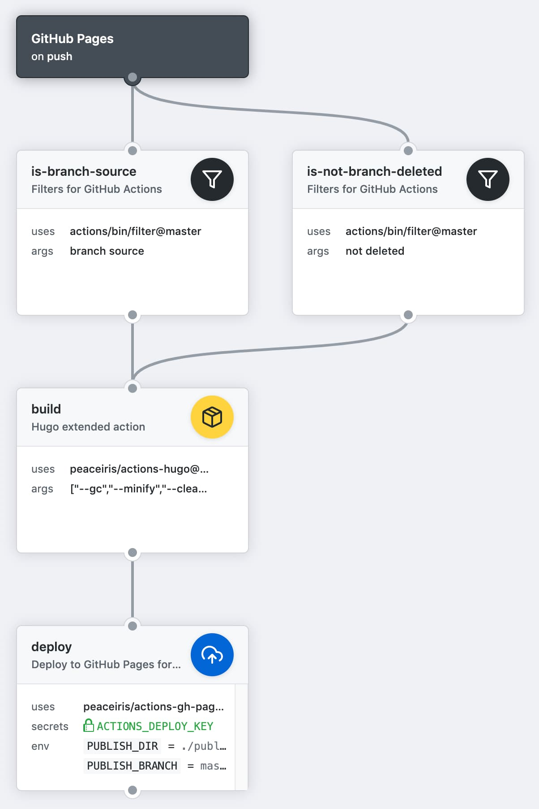
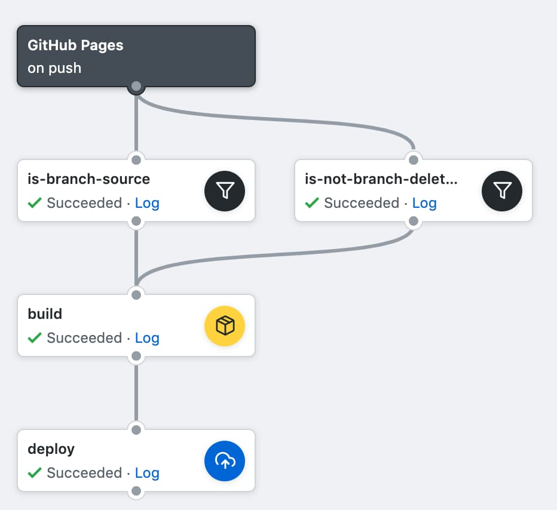

[](https://github.com/peaceiris/actions-gh-pages/blob/master/LICENSE)
[](https://github.com/peaceiris/actions-gh-pages/releases/latest)
[](https://github.com/peaceiris/actions-gh-pages/releases)


## GitHub Actions for deploying to GitHub Pages

A GitHub Action to deploy your static site to GitHub Pages with [Static Site Generators] (Hugo, MkDocs, Gatsby, GitBook, etc.)

[Static Site Generators]: https://www.staticgen.com/


## Getting started

### (1) Add deploy Key

Generate deploy key with the following command.

```sh
ssh-keygen -t rsa -b 4096 -C "your@email.com" -f gh-pages -N ""

# You will get 2 files:
#   gh-pages.pub (public key)
#   gh-pages     (private key)
```

Next, Go to **Repository Settings**

- Go to **Deploy Keys** and add your public key with the "Allow write access"
- Go to **Secrets** and add your private key as `ACTIONS_DEPLOY_KEY`

### (2) Create `main.workflow`

An example with Hugo action.

- [peaceiris/actions-hugo: GitHub Actions for Hugo extended](https://github.com/peaceiris/actions-hugo)


```hcl
workflow "GitHub Pages" {
  on = "push"
  resolves = ["deploy"]
}

action "is-branch-master" {
  uses = "actions/bin/filter@master"
  args = "branch master"
}

action "is-not-branch-deleted" {
  uses = "actions/bin/filter@master"
  args = "not deleted"
}

action "build" {
  needs = ["is-branch-master", "is-not-branch-deleted"]
  uses = "peaceiris/actions-hugo@v0.55.6"
  args = ["--gc", "--minify", "--cleanDestinationDir"]
}

action "deploy" {
  needs = "build"
  uses = "peaceiris/actions-gh-pages@v1.0.1"
  env = {
    PUBLISH_DIR = "./public"
    PUBLISH_BRANCH = "gh-pages"
  }
  secrets = ["ACTIONS_DEPLOY_KEY"]
}
```

| Workflow overview | Actions log |
|---|---|
|  |  |


## Examples

### MkDocs

- [peaceiris/actions-pipenv: GitHub Actions for pipenv](https://github.com/peaceiris/actions-pipenv)
- [main.workflow - peaceiris/mkdocs-material-boilerplate](https://github.com/peaceiris/mkdocs-material-boilerplate/blob/master/.github/main.workflow)


```hcl
workflow "MkDocs workflow" {
  on = "push"
  resolves = ["deploy"]
}

action "branch-filter" {
  uses = "actions/bin/filter@master"
  args = "branch master"
}

action "pipenv-sync" {
  needs = ["branch-filter"]
  uses = "peaceiris/actions-pipenv@3.6"
  args = "sync"
}

action "mkdocs-build" {
  needs = ["pipenv-sync"]
  uses = "peaceiris/actions-pipenv@3.6"
  args = ["run", "mkdocs", "build", "--config-file", "./mkdocs-sample.yml"]
}

action "deploy" {
  needs = ["mkdocs-build"]
  uses = "peaceiris/actions-gh-pages@v1.0.1"
  env = {
    PUBLISH_DIR = "./site"
    PUBLISH_BRANCH = "gh-pages"
  }
  secrets = ["ACTIONS_DEPLOY_KEY"]
}
```


## License

[MIT License - peaceiris/actions-gh-pages]

[MIT License - peaceiris/actions-gh-pages]: https://github.com/peaceiris/actions-gh-pages/blob/master/LICENSE


## About the author

- [peaceiris's homepage](https://peaceiris.com/)

<a href="https://www.patreon.com/peaceiris"></a>
