## GitHub Actions for GitHub Pages

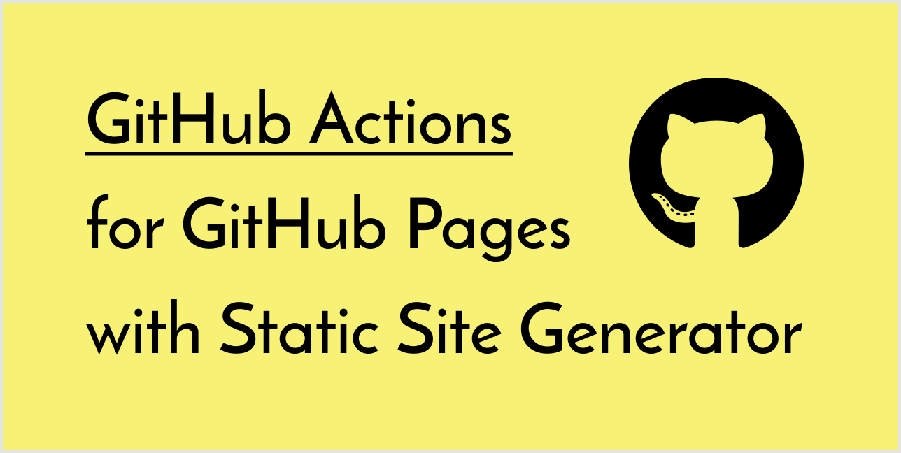

[](https://github.com/peaceiris/actions-gh-pages/blob/main/LICENSE)
[](https://github.com/peaceiris/actions-gh-pages/releases/latest)
[](https://github.com/peaceiris/actions-gh-pages/releases)


[](https://www.codefactor.io/repository/github/peaceiris/actions-gh-pages)

This is a **GitHub Action** to deploy your static files to **GitHub Pages**.
This deploy action can be combined simply and freely with [Static Site Generators]. (Hugo, MkDocs, Gatsby, mdBook, Next, Nuxt, and so on.)

[Static Site Generators]: https://www.staticgen.com/

The next example step will deploy `./public` directory to the remote `gh-pages` branch.

```yaml
- name: Deploy
  uses: peaceiris/actions-gh-pages@v3
  with:
    github_token: ${{ secrets.GITHUB_TOKEN }}
    publish_dir: ./public
```

For newbies of GitHub Actions:
Note that the `GITHUB_TOKEN` is **NOT** a personal access token.
A GitHub Actions runner automatically creates a `GITHUB_TOKEN` secret to authenticate in your workflow.
So, you can start to deploy immediately without any configuration.

### Supported Tokens

Three tokens are supported.

| Token | Private repo | Public repo | Protocol | Setup |
|---|:---:|:---:|---|---|
| `github_token` | ✅️ | ✅️ | HTTPS | Unnecessary |
| `deploy_key` | ✅️ | ✅️ | SSH | Necessary |
| `personal_token` | ✅️ | ✅️ | HTTPS | Necessary |

Notes: Actually, the `GITHUB_TOKEN` works for deploying to GitHub Pages but it has still some limitations.
For the first deployment, we need to select the `gh-pages` branch or another branch on the repository settings tab.
See [First Deployment with `GITHUB_TOKEN`](#%EF%B8%8F-first-deployment-with-github_token)

### Supported Platforms

All Actions runners: Linux (Ubuntu), macOS, and Windows are supported.

| runs-on | `github_token` | `deploy_key` | `personal_token` |
|---|:---:|:---:|:---:|
| ubuntu-20.04 | ✅️ | ✅️ | ✅️ |
| ubuntu-18.04 | ✅️ | ✅️ | ✅️ |
| ubuntu-16.04 | ✅️ | ✅️ | ✅️ |
| macos-latest | ✅️ | ✅️ | ✅️ |
| windows-latest | ✅️ | (2) | ✅️ |

2. WIP, See [Issue #87](https://github.com/peaceiris/actions-gh-pages/issues/87)

<!-- ### GitHub Enterprise Server Support

✅️ GitHub Enterprise Server is supported above `2.22.6`.

Note that the `GITHUB_TOKEN` that is created by the runner might not inherently have push/publish privileges on GHES. You might need to create/request a technical user with write permissions to your target repository. -->

## Table of Contents

<!-- START doctoc generated TOC please keep comment here to allow auto update -->
<!-- DON'T EDIT THIS SECTION, INSTEAD RE-RUN doctoc TO UPDATE -->

- [Getting started](#getting-started)
- [Options](#options)
  - [⭐️ Set Runner's Access Token `github_token`](#%EF%B8%8F-set-runners-access-token-github_token)
  - [⭐️ Set SSH Private Key `deploy_key`](#%EF%B8%8F-set-ssh-private-key-deploy_key)
  - [⭐️ Set Personal Access Token `personal_token`](#%EF%B8%8F-set-personal-access-token-personal_token)
  - [⭐️ Set Another GitHub Pages Branch `publish_branch`](#%EF%B8%8F-set-another-github-pages-branch-publish_branch)
  - [⭐️ Source Directory `publish_dir`](#%EF%B8%8F-source-directory-publish_dir)
  - [⭐️ Deploy to Subdirectory `destination_dir`](#%EF%B8%8F-deploy-to-subdirectory-destination_dir)
  - [⭐️ Filter publishing assets `exclude_assets`](#%EF%B8%8F-filter-publishing-assets-exclude_assets)
  - [⭐️ Add CNAME file `cname`](#%EF%B8%8F-add-cname-file-cname)
  - [⭐️ Enable Built-in Jekyll `enable_jekyll`](#%EF%B8%8F-enable-built-in-jekyll-enable_jekyll)
  - [⭐️ Allow empty commits `allow_empty_commit`](#%EF%B8%8F-allow-empty-commits-allow_empty_commit)
  - [⭐️ Keeping existing files `keep_files`](#%EF%B8%8F-keeping-existing-files-keep_files)
  - [⭐️ Deploy to external repository `external_repository`](#%EF%B8%8F-deploy-to-external-repository-external_repository)
  - [⭐️ Force orphan `force_orphan`](#%EF%B8%8F-force-orphan-force_orphan)
  - [⭐️ Set Git username and email](#%EF%B8%8F-set-git-username-and-email)
  - [⭐️ Set custom commit message](#%EF%B8%8F-set-custom-commit-message)
  - [⭐️ Create Git tag](#%EF%B8%8F-create-git-tag)
- [Tips and FAQ](#tips-and-faq)
  - [⭐️ Create SSH Deploy Key](#%EF%B8%8F-create-ssh-deploy-key)
  - [⭐️ First Deployment with `GITHUB_TOKEN`](#%EF%B8%8F-first-deployment-with-github_token)
  - [⭐️ Use the latest and specific release](#%EF%B8%8F-use-the-latest-and-specific-release)
  - [⭐️ Schedule and Manual Deployment](#%EF%B8%8F-schedule-and-manual-deployment)
- [Examples](#examples)
  - [⭐️ Static Site Generators with Node.js](#%EF%B8%8F-static-site-generators-with-nodejs)
  - [⭐️ Gatsby](#%EF%B8%8F-gatsby)
  - [⭐️ React and Next](#%EF%B8%8F-react-and-next)
  - [⭐️ Vue and Nuxt](#%EF%B8%8F-vue-and-nuxt)
  - [⭐️ Docusaurus](#%EF%B8%8F-docusaurus)
  - [⭐️ Static Site Generators with Python](#%EF%B8%8F-static-site-generators-with-python)
  - [⭐️ mdBook (Rust)](#%EF%B8%8F-mdbook-rust)
  - [⭐️ Flutter Web](#%EF%B8%8F-flutter-web)
  - [⭐️ Elm](#%EF%B8%8F-elm)
  - [⭐️ github/personal-website](#%EF%B8%8F-githubpersonal-website)
  - [⭐️ Swift Publish](#%EF%B8%8F-swift-publish)
- [License](#license)
- [Maintainer](#maintainer)

<!-- END doctoc generated TOC please keep comment here to allow auto update -->


## Getting started

Add your workflow file `.github/workflows/gh-pages.yml` and push it to your remote default branch.

Here is an example workflow for Hugo.

- [peaceiris/actions-hugo: GitHub Actions for Hugo](https://github.com/peaceiris/actions-hugo)

[](https://github.com/peaceiris/actions-hugo)

```yaml
name: github pages

on:
  push:
    branches:
      - main  # Set a branch name to trigger deployment

jobs:
  deploy:
    runs-on: ubuntu-18.04
    steps:
      - uses: actions/checkout@v2
        with:
          submodules: true  # Fetch Hugo themes (true OR recursive)
          fetch-depth: 0    # Fetch all history for .GitInfo and .Lastmod

      - name: Setup Hugo
        uses: peaceiris/actions-hugo@v2
        with:
          hugo-version: '0.79.1'

      - name: Build
        run: hugo --minify

      - name: Deploy
        uses: peaceiris/actions-gh-pages@v3
        with:
          github_token: ${{ secrets.GITHUB_TOKEN }}
          publish_dir: ./public
```

| Actions log overview | GitHub Pages log |
|---|---|
| 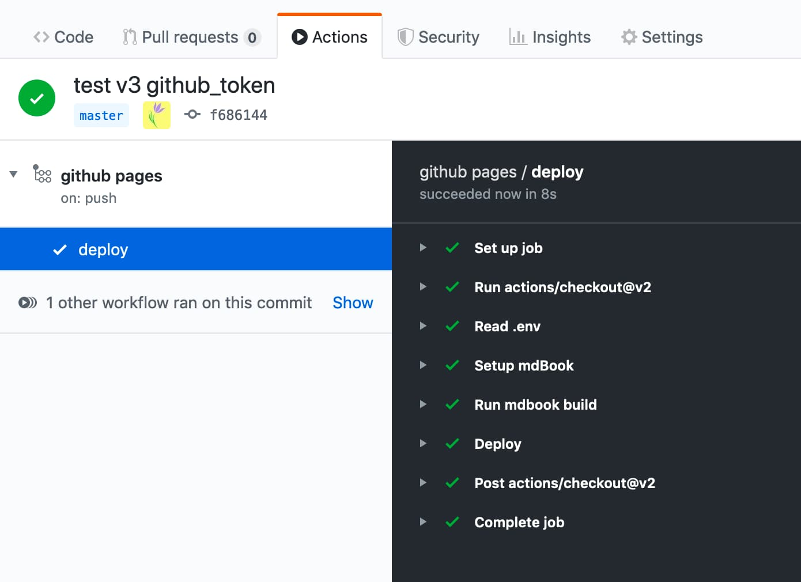 | 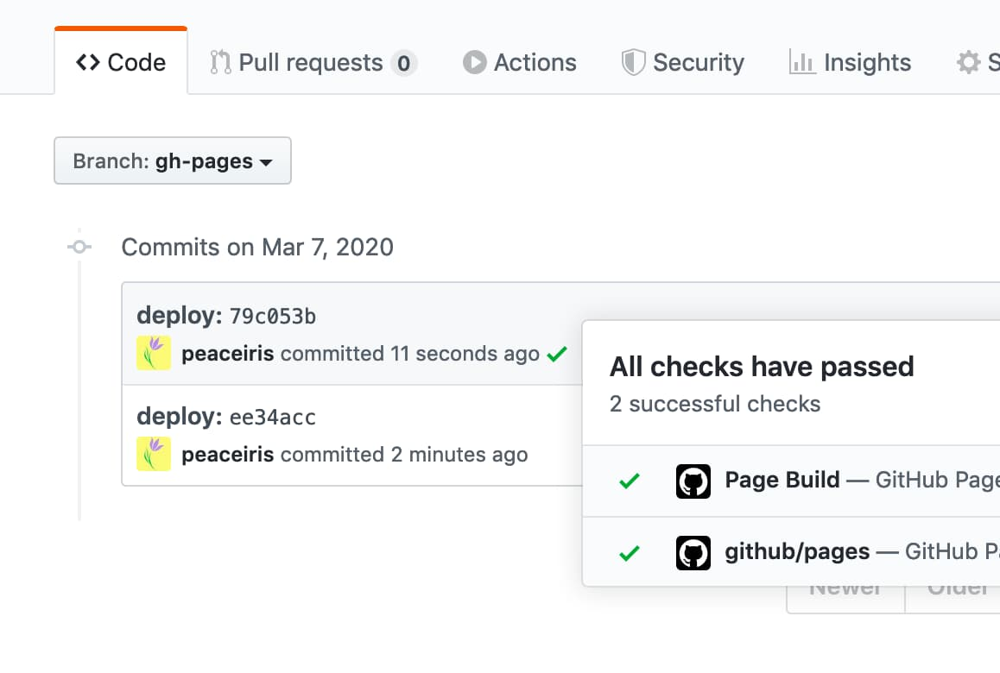 |

<div align="right">
<a href="#table-of-contents">Back to TOC ☝️</a>
</div>


## Options

### ⭐️ Set Runner's Access Token `github_token`

**This option is for `GITHUB_TOKEN`, not a personal access token.**

A GitHub Actions runner automatically creates a `GITHUB_TOKEN` secret to use in your workflow. You can use the `GITHUB_TOKEN` to authenticate in a workflow run.

```yaml
- name: Deploy
  uses: peaceiris/actions-gh-pages@v3
  with:
    github_token: ${{ secrets.GITHUB_TOKEN }}
    publish_dir: ./public
```

For more details about `GITHUB_TOKEN`: [Authenticating with the GITHUB_TOKEN - GitHub Help](https://help.github.com/en/actions/configuring-and-managing-workflows/authenticating-with-the-github_token)

### ⭐️ Set SSH Private Key `deploy_key`

Read [Create SSH Deploy Key](#%EF%B8%8F-create-ssh-deploy-key), create your SSH deploy key, and set the `deploy_key` option like the following.

```yaml
- name: Deploy
  uses: peaceiris/actions-gh-pages@v3
  with:
    deploy_key: ${{ secrets.ACTIONS_DEPLOY_KEY }}
    publish_dir: ./public
```

### ⭐️ Set Personal Access Token `personal_token`

[Generate a personal access token (`repo`)](https://github.com/settings/tokens) and add it to Secrets as `PERSONAL_TOKEN`, it works as well as `ACTIONS_DEPLOY_KEY`.

```yaml
- name: Deploy
  uses: peaceiris/actions-gh-pages@v3
  with:
    personal_token: ${{ secrets.PERSONAL_TOKEN }}
    publish_dir: ./public
```

### ⭐️ Set Another GitHub Pages Branch `publish_branch`

Set a branch name to use as GitHub Pages branch.
The default is `gh-pages`.

```yaml
- name: Deploy
  uses: peaceiris/actions-gh-pages@v3
  with:
    github_token: ${{ secrets.GITHUB_TOKEN }}
    publish_branch: your-branch  # default: gh-pages
```

### ⭐️ Source Directory `publish_dir`

A source directory to deploy to GitHub Pages. The default is `public`.

```yaml
- name: Deploy
  uses: peaceiris/actions-gh-pages@v3
  with:
    github_token: ${{ secrets.GITHUB_TOKEN }}
    publish_dir: ./out  # default: public
```

### ⭐️ Deploy to Subdirectory `destination_dir`

*This feature is on beta.*
*Any feedback is welcome at [Issue #324](https://github.com/peaceiris/actions-gh-pages/issues/324)*

A destination subdirectory on a publishing branch. The default is empty.

```yaml
- name: Deploy
  uses: peaceiris/actions-gh-pages@v3
  with:
    github_token: ${{ secrets.GITHUB_TOKEN }}
    destination_dir: subdir
```

### ⭐️ Filter publishing assets `exclude_assets`

*This feature is on beta.*
*Any feedback is welcome at [Issue #163](https://github.com/peaceiris/actions-gh-pages/issues/163)*

Set files or directories to exclude from publishing assets.
The default is `.github`.
Values should be split with a comma.

```yaml
- name: Deploy
  uses: peaceiris/actions-gh-pages@v3
  with:
    github_token: ${{ secrets.GITHUB_TOKEN }}
    exclude_assets: '.github,exclude-file1,exclude-file2'
```

Set `exclude_assets` to empty for including the `.github` directory to deployment assets.

```yaml
- name: Deploy
  uses: peaceiris/actions-gh-pages@v3
  with:
    deploy_key: ${{ secrets.ACTIONS_DEPLOY_KEY }}   # Recommended for this usage
    # personal_token: ${{ secrets.PERSONAL_TOKEN }} # An alternative
    # github_token: ${{ secrets.GITHUB_TOKEN }}     # This does not work for this usage
    exclude_assets: ''
```

The `exclude_assets` option supports glob patterns.

```yaml
- name: Deploy
  uses: peaceiris/actions-gh-pages@v3
  with:
    github_token: ${{ secrets.GITHUB_TOKEN }}
    exclude_assets: '.github,exclude-file.txt,exclude-dir/**.txt'
```

### ⭐️ Add CNAME file `cname`

To add `CNAME` file, we can set the `cname` option.

For more details about `CNAME`, read the official documentation: [Managing a custom domain for your GitHub Pages site - GitHub Help](https://help.github.com/en/github/working-with-github-pages/managing-a-custom-domain-for-your-github-pages-site)

```yaml
- name: Deploy
  uses: peaceiris/actions-gh-pages@v3
  with:
    github_token: ${{ secrets.GITHUB_TOKEN }}
    publish_dir: ./public
    cname: github.com
```

### ⭐️ Enable Built-in Jekyll `enable_jekyll`

If you want GitHub Pages to process your site with the static site generator Jekyll, set `enable_jekyll` to true.

[github/personal-website](https://github.com/peaceiris/actions-gh-pages#%EF%B8%8F-githubpersonal-website) is one of the examples using GitHub Pages built-in Jekyll.

By default, this action signals to GitHub Pages that the site shall not be processed with Jekyll. This is done by adding an empty `.nojekyll` file when publishing to the master or gh-pages branch. When a `.nojekyll` file already exists, this action does nothing.

Bypassing Jekyll makes the deployment faster and is necessary if you are deploying files or directories that start with underscores, since Jekyll considers these to be special resources and does not copy them to the final site. You only need to set `enable_jekyll` to true when you want to deploy a Jekyll-powered website and let GitHub Pages do the Jekyll processing.


```yaml
- name: Deploy
  uses: peaceiris/actions-gh-pages@v3
  with:
    github_token: ${{ secrets.GITHUB_TOKEN }}
    publish_dir: ./public
    enable_jekyll: true
```

For more details about `.nojekyll`: [Bypassing Jekyll on GitHub Pages - The GitHub Blog](https://github.blog/2009-12-29-bypassing-jekyll-on-github-pages/)

### ⭐️ Allow empty commits `allow_empty_commit`

By default, a commit will not be generated when no file changes. If you want to allow an empty commit, set the optional parameter `allow_empty_commit` to `true`.

For example:

```yaml
- name: Deploy
  uses: peaceiris/actions-gh-pages@v3
  with:
    github_token: ${{ secrets.GITHUB_TOKEN }}
    publish_dir: ./public
    allow_empty_commit: true
```

### ⭐️ Keeping existing files `keep_files`

By default, existing files in the publish branch (or only in `destination_dir` if given) will be removed. If you want the action to add new files but leave existing ones untouched, set the optional parameter `keep_files` to `true`.

Note that users who are using a Static Site Generator do not need this option in most cases. Please reconsider your project structure and building scripts, or use a built-in feature of a Static Site Generator before you enable this flag.

- [Static Files | Hugo](https://gohugo.io/content-management/static-files/)
- [Using the Static Folder | Gatsby](https://www.gatsbyjs.com/docs/static-folder/)

For example:

```yaml
- name: Deploy
  uses: peaceiris/actions-gh-pages@v3
  with:
    github_token: ${{ secrets.GITHUB_TOKEN }}
    publish_dir: ./public
    keep_files: true
```

With the v3, this option does not support working with the force_orphan option. The next major release (version 4) will support this.
See [the issue #455](https://github.com/peaceiris/actions-gh-pages/issues/455)

### ⭐️ Deploy to external repository `external_repository`

By default, your files are published to the repository which is running this action.
If you want to publish to another repository on GitHub, set the environment variable `external_repository` to `<username>/<external-repository>`.

For example:

```yaml
- name: Deploy
  uses: peaceiris/actions-gh-pages@v3
  with:
    deploy_key: ${{ secrets.ACTIONS_DEPLOY_KEY }}
    external_repository: username/external-repository
    publish_branch: your-branch  # default: gh-pages
    publish_dir: ./public
```

You can use `deploy_key` or `personal_token`.
When you use `deploy_key`, set your private key to the repository which includes this action and set your public key to your external repository.

**Note that `GITHUB_TOKEN` has no permission to access to external repositories. Please create a personal access token and set it to `personal_token` like `personal_token: ${{ secrets.PERSONAL_TOKEN }}`.**

Use case:

A GitHub Free Plan account cannot use the GitHub Pages in a private repository. To make your source contents private and deploy it with the GitHub Pages, you can deploy your site from a private repository to a public repository using this option.

- `peaceiris/homepage`: A private repository running this action with `external_repository: peaceiris/peaceiris.github.io`
- `peaceiris/peaceiris.github.io`: A public repository using GitHub Pages

### ⭐️ Force orphan `force_orphan`

We can set the `force_orphan: true` option.
This allows you to make your publish branch with only the latest commit.

```yaml
- name: Deploy
  uses: peaceiris/actions-gh-pages@v3
  with:
    github_token: ${{ secrets.GITHUB_TOKEN }}
    publish_dir: ./public
    force_orphan: true
```

### ⭐️ Set Git username and email

Set custom `git config user.name` and `git config user.email`.
A commit is always created with the same user.

```yaml
- name: Deploy
  uses: peaceiris/actions-gh-pages@v3
  with:
    github_token: ${{ secrets.GITHUB_TOKEN }}
    publish_dir: ./public
    user_name: 'github-actions[bot]'
    user_email: 'github-actions[bot]@users.noreply.github.com'
```

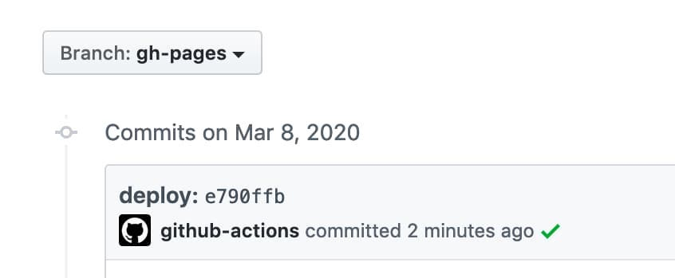

### ⭐️ Set custom commit message

Set a custom commit message.
When we create a commit with a message `docs: Update some post`, a deployment commit will be generated with a message `docs: Update some post ${GITHUB_SHA}`.

```yaml
- name: Deploy
  uses: peaceiris/actions-gh-pages@v3
  with:
    github_token: ${{ secrets.GITHUB_TOKEN }}
    publish_dir: ./public
    commit_message: ${{ github.event.head_commit.message }}
```

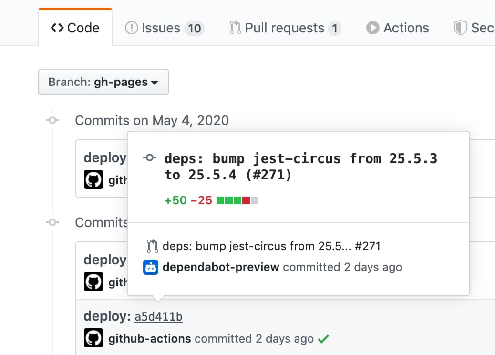

To set a full custom commit message without a triggered commit hash,
use the `full_commit_message` option instead of the `commit_message` option.

```yaml
- name: Deploy
  uses: peaceiris/actions-gh-pages@v3
  with:
    github_token: ${{ secrets.GITHUB_TOKEN }}
    publish_dir: ./public
    full_commit_message: ${{ github.event.head_commit.message }}
```

### ⭐️ Create Git tag

Here is an example workflow.

```yaml
name: github pages

on:
  push:
    branches:
      - main
    tags:
      - 'v*.*.*'

jobs:
  deploy:
    runs-on: ubuntu-18.04
    steps:
      - uses: actions/checkout@v2

      - name: Some build

      - name: Prepare tag
        id: prepare_tag
        if: startsWith(github.ref, 'refs/tags/')
        run: |
          TAG_NAME="${GITHUB_REF##refs/tags/}"
          echo "::set-output name=tag_name::${TAG_NAME}"
          echo "::set-output name=deploy_tag_name::deploy-${TAG_NAME}"

      - name: Deploy
        uses: peaceiris/actions-gh-pages@v3
        with:
          github_token: ${{ secrets.GITHUB_TOKEN }}
          publish_dir: ./public
          tag_name: ${{ steps.prepare_tag.outputs.deploy_tag_name }}
          tag_message: 'Deployment ${{ steps.prepare_tag.outputs.tag_name }}'
```

Commands on a local machine.

```console
$ # On a main branch
$ git tag -a "v1.2.3" -m "Release v1.2.3"
$ git push origin "v1.2.3"

$ # After deployment
$ git fetch origin
$ git tag
deploy-v1.2.3  # Tag on the gh-pages branch
v1.2.3         # Tag on the main branch
```

<div align="right">
<a href="#table-of-contents">Back to TOC ☝️</a>
</div>


## Tips and FAQ

### ⭐️ Create SSH Deploy Key

Generate your deploy key with the following command.

```sh
ssh-keygen -t rsa -b 4096 -C "$(git config user.email)" -f gh-pages -N ""
# You will get 2 files:
#   gh-pages.pub (public key)
#   gh-pages     (private key)
```

Next, Go to **Repository Settings**

- Go to **Deploy Keys** and add your public key with the **Allow write access**
- Go to **Secrets** and add your private key as `ACTIONS_DEPLOY_KEY`

| Add your public key | Success |
|---|---|
| 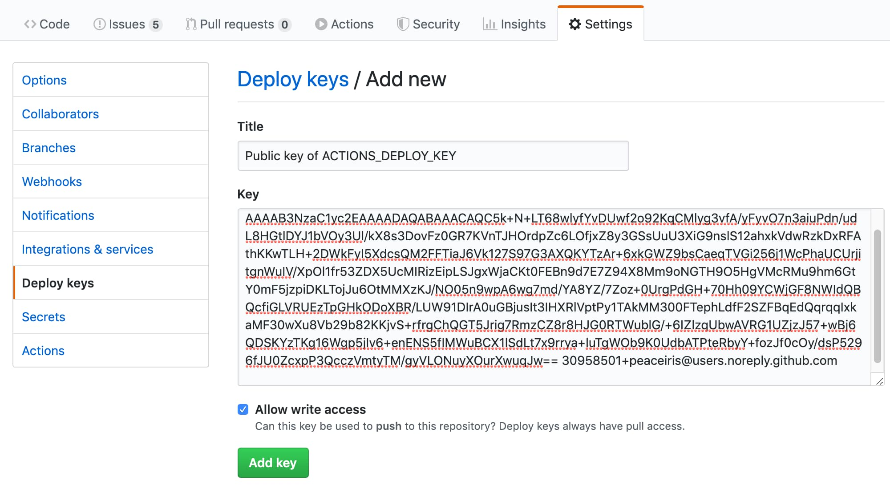 | 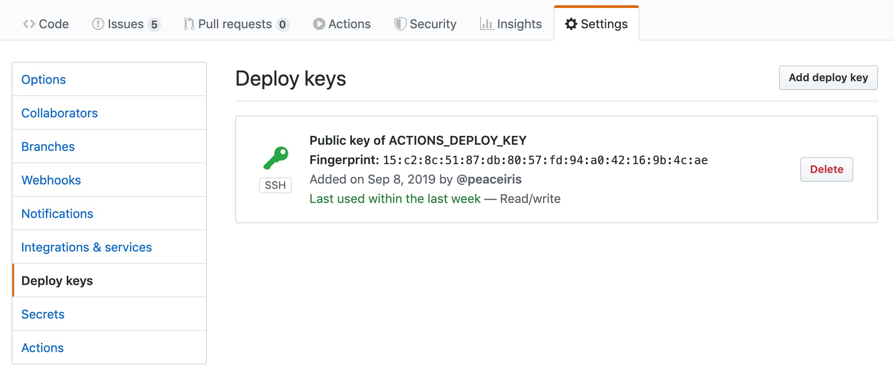 |

| Add your private key | Success |
|---|---|
| 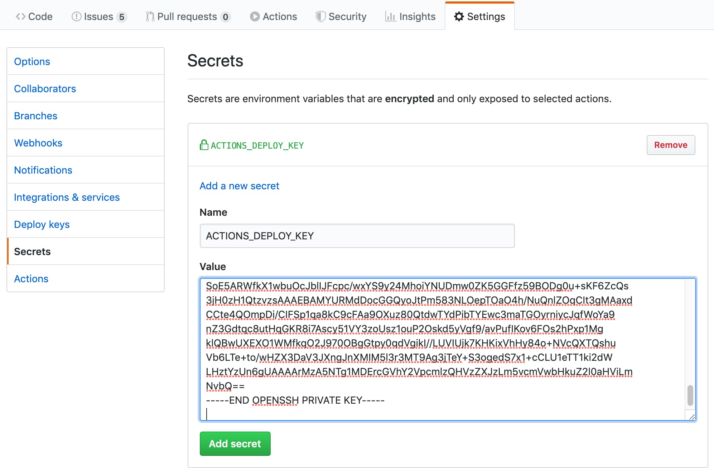 | 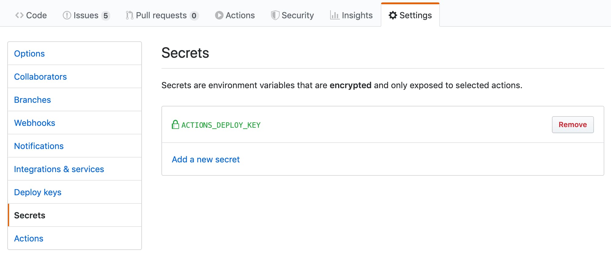 |

### ⭐️ First Deployment with `GITHUB_TOKEN`

The `GITHUB_TOKEN` has limitations for the first deployment so we have to select the GitHub Pages branch on the repository settings tab. After that, do the second deployment like the following pictures.

| First deployment failed | Go to the settings tab |
|---|---|
| 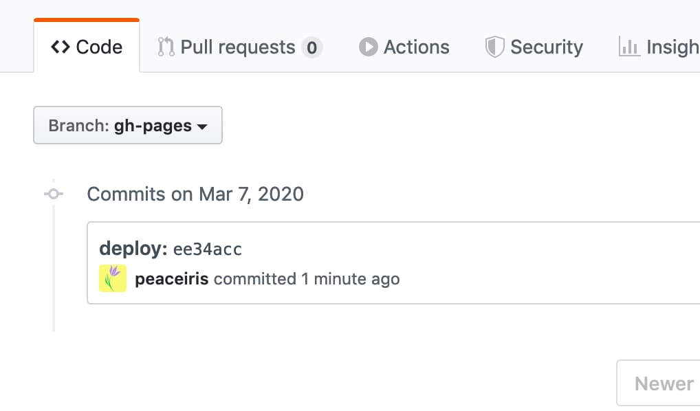 | 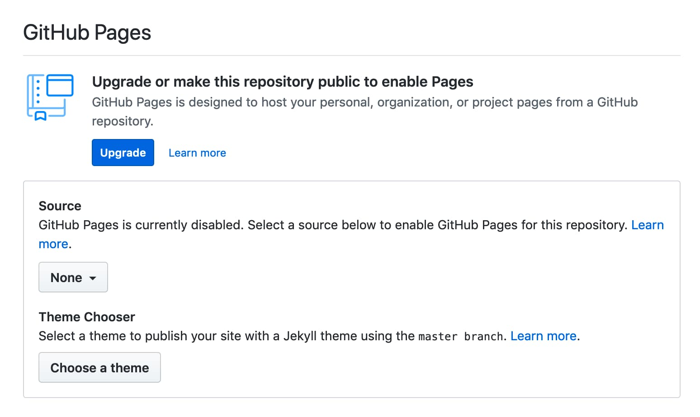 |

| Select branch | Deploying again and succeed |
|---|---|
| 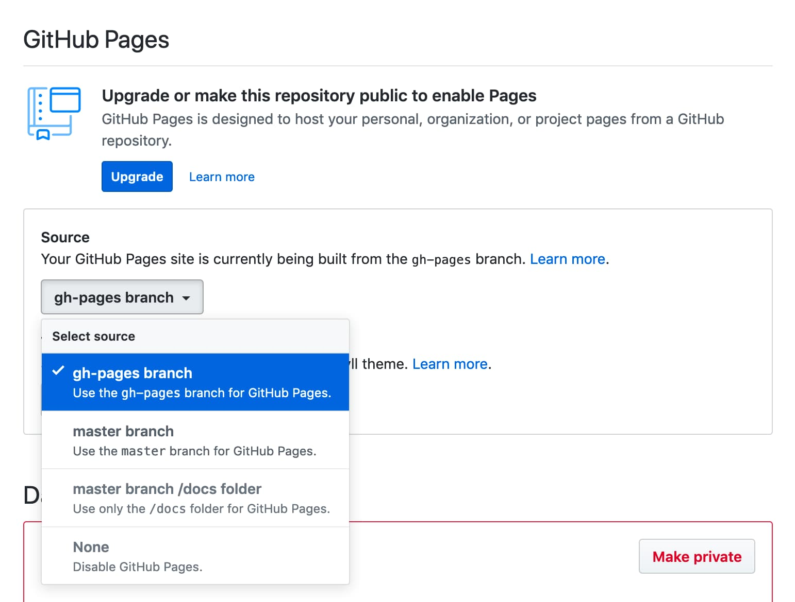 |  |

### ⭐️ Use the latest and specific release

We recommend you to use the latest and specific release of this action for stable CI/CD.
It is useful to watch this repository (release only) to check the [latest release] of this action.

[latest release]: https://github.com/peaceiris/actions-gh-pages/releases

For continuous updating, we can use the GitHub native Dependabot.
Here is an example configuration of the bot. The config file is located in `.github/dependabot.yml`.

```yaml
version: 2
updates:
- package-ecosystem: "github-actions"
  directory: "/"
  schedule:
    interval: "daily"
  labels:
  - "CI/CD"
  commit-message:
    prefix: ci
```

See the official documentation for more details about the Dependabot: [Keeping your dependencies updated automatically - GitHub Docs](https://docs.github.com/en/github/administering-a-repository/keeping-your-dependencies-updated-automatically)

### ⭐️ Schedule and Manual Deployment

For deploying regularly, we can set the `on.schedule` workflow trigger.
See [Scheduled events | Events that trigger workflows - GitHub Docs](https://docs.github.com/en/actions/reference/events-that-trigger-workflows#scheduled-events)

For deploying manually, we can set the `on.workflow_dispatch` workflow trigger.
See [Manual events `workflow_dispatch` | Events that trigger workflows - GitHub Docs](https://docs.github.com/en/actions/reference/events-that-trigger-workflows#manual-events)

```yaml
name: github pages

on:
  push:
    branches:
      - main
  schedule:
    - cron: "22 22 * * *"
  workflow_dispatch:

jobs:
  deploy:
    runs-on: ubuntu-18.04
    steps:
    ...
```

<div align="right">
<a href="#table-of-contents">Back to TOC ☝️</a>
</div>


## Examples

### ⭐️ Static Site Generators with Node.js

[hexo], [vuepress], [react-static], [gridsome], [create-react-app] and so on.
Please check where your output directory is before pushing your workflow.
e.g. `create-react-app` requires `publish_dir` to be set to `./build`

[hexo]: https://github.com/hexojs/hexo
[vuepress]: https://github.com/vuejs/vuepress
[react-static]: https://github.com/react-static/react-static
[gridsome]: https://github.com/gridsome/gridsome
[create-react-app]: https://github.com/facebook/create-react-app

Premise: Dependencies are managed by `package.json` and `package-lock.json`

```yaml
name: github pages

on:
  push:
    branches:
      - main

jobs:
  deploy:
    runs-on: ubuntu-18.04
    steps:
      - uses: actions/checkout@v2

      - name: Setup Node
        uses: actions/setup-node@v2.1.2
        with:
          node-version: '12.x'

      - name: Cache dependencies
        uses: actions/cache@v2
        with:
          path: ~/.npm
          key: ${{ runner.os }}-node-${{ hashFiles('**/package-lock.json') }}
          restore-keys: |
            ${{ runner.os }}-node-

      - run: npm ci
      - run: npm run build

      - name: Deploy
        uses: peaceiris/actions-gh-pages@v3
        with:
          github_token: ${{ secrets.GITHUB_TOKEN }}
          publish_dir: ./public
```

### ⭐️ Gatsby

An example for [Gatsby] (Gatsby.js) project with [gatsby-starter-blog]

[Gatsby]: https://github.com/gatsbyjs/gatsby
[gatsby-starter-blog]: https://github.com/gatsbyjs/gatsby-starter-blog

```yaml
name: github pages

on:
  push:
    branches:
      - main

jobs:
  deploy:
    runs-on: ubuntu-18.04
    steps:
      - uses: actions/checkout@v2

      - name: Setup Node
        uses: actions/setup-node@v2.1.2
        with:
          node-version: '12.x'

      - name: Cache dependencies
        uses: actions/cache@v2
        with:
          path: ~/.npm
          key: ${{ runner.os }}-node-${{ hashFiles('**/package-lock.json') }}
          restore-keys: |
            ${{ runner.os }}-node-

      - run: npm ci
      - run: npm run format
      - run: npm run test
      - run: npm run build

      - name: Deploy
        uses: peaceiris/actions-gh-pages@v3
        with:
          github_token: ${{ secrets.GITHUB_TOKEN }}
          publish_dir: ./public
```

### ⭐️ React and Next

An example for [Next.js] (React.js) project with [create-next-app]

- cf. [Deploying a Next.js app into GitHub Pages · zeit/next.js Wiki](https://github.com/zeit/next.js/wiki/Deploying-a-Next.js-app-into-GitHub-Pages)

[Next.js]: https://github.com/zeit/next.js
[create-next-app]: https://nextjs.org/docs

```yaml
name: github pages

on:
  push:
    branches:
      - main

jobs:
  deploy:
    runs-on: ubuntu-18.04
    steps:
      - uses: actions/checkout@v2

      - name: Setup Node
        uses: actions/setup-node@v2.1.2
        with:
          node-version: '12.x'

      - name: Get yarn cache
        id: yarn-cache
        run: echo "::set-output name=dir::$(yarn cache dir)"

      - name: Cache dependencies
        uses: actions/cache@v2
        with:
          path: ${{ steps.yarn-cache.outputs.dir }}
          key: ${{ runner.os }}-yarn-${{ hashFiles('**/yarn.lock') }}
          restore-keys: |
            ${{ runner.os }}-yarn-

      - run: yarn install --frozen-lockfile
      - run: yarn build
      - run: yarn export

      - name: Deploy
        uses: peaceiris/actions-gh-pages@v3
        with:
          github_token: ${{ secrets.GITHUB_TOKEN }}
          publish_dir: ./out
```

### ⭐️ Vue and Nuxt

An example for [Nuxt.js] (Vue.js) project with [create-nuxt-app]

- cf. [GitHub Pages Deployment - Nuxt.js](https://nuxtjs.org/faq/github-pages)

[Nuxt.js]: https://github.com/nuxt/nuxt.js
[create-nuxt-app]: https://github.com/nuxt/create-nuxt-app

```yaml
name: github pages

on:
  push:
    branches:
      - main

jobs:
  deploy:
    runs-on: ubuntu-18.04
    steps:
      - uses: actions/checkout@v2

      - name: Setup Node
        uses: actions/setup-node@v2.1.2
        with:
          node-version: '12.x'

      - name: Cache dependencies
        uses: actions/cache@v2
        with:
          path: ~/.npm
          key: ${{ runner.os }}-node-${{ hashFiles('**/package-lock.json') }}
          restore-keys: |
            ${{ runner.os }}-node-

      - run: npm ci
      - run: npm test
      - run: npm run generate

      - name: deploy
        uses: peaceiris/actions-gh-pages@v3
        with:
          github_token: ${{ secrets.GITHUB_TOKEN }}
          publish_dir: ./dist
```

### ⭐️ Docusaurus

An example workflow for [Docusaurus](https://docusaurus.io/).

`npx @docusaurus/init@next init website classic` is useful to create a new Docusaurus project.

```yaml
# .github/workflows/deploy.yml

name: github pages

on:
  push:
    branches:
      - main
    paths:
      - '.github/workflows/deploy.yml'
      - 'website/**'

jobs:
  deploy:
    runs-on: ubuntu-18.04
    defaults:
      run:
        working-directory: website
    steps:
      - uses: actions/checkout@v2

      - name: Setup Node
        uses: actions/setup-node@v2.1.2
        with:
          node-version: '12.x'

      - name: Get yarn cache
        id: yarn-cache
        run: echo "::set-output name=dir::$(yarn cache dir)"

      - name: Cache dependencies
        uses: actions/cache@v2
        with:
          path: ${{ steps.yarn-cache.outputs.dir }}
          key: ${{ runner.os }}-website-${{ hashFiles('**/yarn.lock') }}
          restore-keys: |
            ${{ runner.os }}-website-

      - run: yarn install --frozen-lockfile
      - run: yarn build

      - name: Deploy
        uses: peaceiris/actions-gh-pages@v3
        with:
          github_token: ${{ secrets.GITHUB_TOKEN }}
          publish_dir: ./website/build
```

### ⭐️ Static Site Generators with Python

[pelican], [MkDocs], [sphinx], and so on.

[pelican]: https://github.com/getpelican/pelican
[MkDocs]: https://github.com/mkdocs/mkdocs
[sphinx]: https://github.com/sphinx-doc/sphinx

Premise: Dependencies are managed by `requirements.txt`

```yaml
name: github pages

on:
  push:
    branches:
      - main

jobs:
  deploy:
    runs-on: ubuntu-18.04
    steps:
      - uses: actions/checkout@v2

      - name: Setup Python
        uses: actions/setup-python@v2
        with:
          python-version: '3.8'

      - name: Upgrade pip
        run: |
          # install pip=>20.1 to use "pip cache dir"
          python3 -m pip install --upgrade pip

      - name: Get pip cache dir
        id: pip-cache
        run: echo "::set-output name=dir::$(pip cache dir)"

      - name: Cache dependencies
        uses: actions/cache@v2
        with:
          path: ${{ steps.pip-cache.outputs.dir }}
          key: ${{ runner.os }}-pip-${{ hashFiles('**/requirements.txt') }}
          restore-keys: |
            ${{ runner.os }}-pip-

      - name: Install dependencies
        run: python3 -m pip install -r ./requirements.txt

      - run: mkdocs build

      - name: Deploy
        uses: peaceiris/actions-gh-pages@v3
        with:
          github_token: ${{ secrets.GITHUB_TOKEN }}
          publish_dir: ./site
```

### ⭐️ mdBook (Rust)

An example GitHub Actions workflow to deploy [rust-lang/mdBook] site to GitHub Pages.

[rust-lang/mdBook]: https://github.com/rust-lang/mdBook

- [peaceiris/actions-mdbook: GitHub Actions for mdBook (rust-lang/mdBook)](https://github.com/peaceiris/actions-mdbook)

```yaml
name: github pages

on:
  push:
    branches:
      - main

jobs:
  deploy:
    runs-on: ubuntu-18.04
    steps:
      - uses: actions/checkout@v2

      - name: Setup mdBook
        uses: peaceiris/actions-mdbook@v1
        with:
          mdbook-version: '0.4.5'
          # mdbook-version: 'latest'

      - run: mdbook build

      - name: Deploy
        uses: peaceiris/actions-gh-pages@v3
        with:
          github_token: ${{ secrets.GITHUB_TOKEN }}
          publish_dir: ./book
```

### ⭐️ Flutter Web

An exapmle workflow for [Flutter web project].

[Flutter web project]: https://flutter.dev/docs/get-started/web

```yaml
name: github pages

on:
  push:
    branches:
      - main

jobs:
  deploy:
    runs-on: ubuntu-18.04
    steps:
      - uses: actions/checkout@v2

      - name: Setup Flutter
        run: |
          git clone https://github.com/flutter/flutter.git --depth 1 -b beta _flutter
          echo "${GITHUB_WORKSPACE}/_flutter/bin" >> ${GITHUB_PATH}

      - name: Install
        run: |
          flutter config --enable-web
          flutter pub get

      - name: Build
        run: flutter build web

      - name: Deploy
        uses: peaceiris/actions-gh-pages@v3
        with:
          github_token: ${{ secrets.GITHUB_TOKEN }}
          publish_dir: ./build/web
```

### ⭐️ Elm

An example workflow for [Elm].

[Elm]: https://elm-lang.org

```yaml
name: github pages

on:
  push:
    branches:
      - main

jobs:
  deploy:
    runs-on: ubuntu-18.04
    steps:
      - uses: actions/checkout@v2

      - name: Setup Node
        uses: actions/setup-node@v2.1.2
        with:
          node-version: '12.x'

      - name: Setup Elm
        run: npm install elm --global

      - name: Make
        run: elm make --optimize src/Main.elm

      - name: Move files
        run: |
          mkdir ./public
          mv ./index.html ./public/
        # If you have non-minimal setup with some assets and separate html/js files,
        # provide --output=<output-file> option for `elm make` and remove this step

      - name: Deploy
        uses: peaceiris/actions-gh-pages@v3
        with:
          github_token: ${{ secrets.GITHUB_TOKEN }}
          publish_dir: ./public
```

### ⭐️ github/personal-website

- [github/personal-website](https://github.com/github/personal-website) - Code that'll help you kickstart a personal website that showcases your work as a software developer.

```yaml
# .github/workflows/github-pages.yml

name: GitHub Pages

on:
  push:
    branches:
      - master
  schedule:
    - cron: '24 */24 * * *'  # Once a day

jobs:
  deploy:
    runs-on: ubuntu-18.04
    steps:
      - uses: actions/checkout@v2
      - name: Deploy to GitHub Pages
        uses: peaceiris/actions-gh-pages@v3
        with:
          github_token: ${{ secrets.GITHUB_TOKEN }}
          publish_dir: ./
          allow_empty_commit: true
          enable_jekyll: true
          cname: github.peaceiris.com
```

### ⭐️ Swift Publish

An example workflow for [JohnSundell/Publish].

[JohnSundell/Publish]: https://github.com/JohnSundell/Publish

```yaml
name: GitHub Pages

on:
  push:
    branches:
      - main

jobs:
  deploy:
    runs-on: macos-latest
    steps:
      - uses: actions/checkout@v2

      - uses: actions/cache@v2
        with:
          path: |
            ~/Publish_build
            .build
          key: ${{ runner.os }}-spm-${{ hashFiles('**/Package.resolved') }}
          restore-keys: |
            ${{ runner.os }}-spm-

      - name: Setup JohnSundell/Publish
        run: |
          cd ${HOME}
          export PUBLISH_VERSION="0.7.0"
          git clone https://github.com/JohnSundell/Publish.git
          cd ./Publish && git checkout ${PUBLISH_VERSION}
          mv ~/Publish_build .build || true
          swift build -c release
          cp -r .build ~/Publish_build || true
          echo "${HOME}/Publish/.build/release" >> ${GITHUB_PATH}

      - run: publish-cli generate

      - name: Deploy to GitHub Pages
        uses: peaceiris/actions-gh-pages@v3
        with:
          github_token: ${{ secrets.GITHUB_TOKEN }}
          publish_dir: ./Output
```

<div align="right">
<a href="#table-of-contents">Back to TOC ☝️</a>
</div>


## License

- [MIT License - peaceiris/actions-gh-pages]

[MIT License - peaceiris/actions-gh-pages]: https://github.com/peaceiris/actions-gh-pages/blob/main/LICENSE


## Maintainer

- [peaceiris homepage](https://peaceiris.com/)
- [GitHub Action Hero: Shohei Ueda - The GitHub Blog](https://github.blog/2020-03-22-github-action-hero-shohei-ueda/)


<div align="right">
<a href="#table-of-contents">Back to TOC ☝️</a>
</div>
